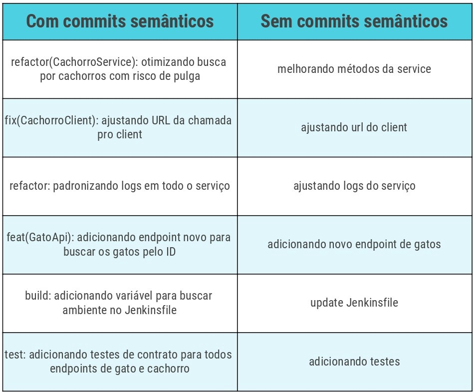
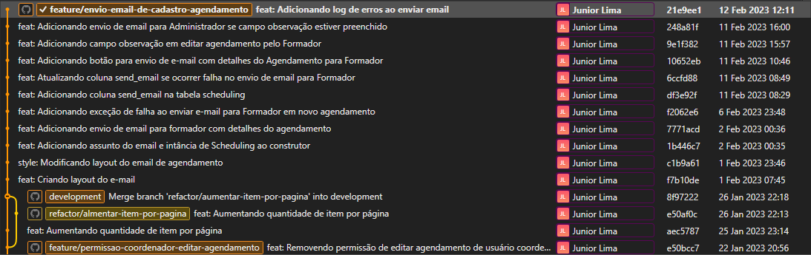
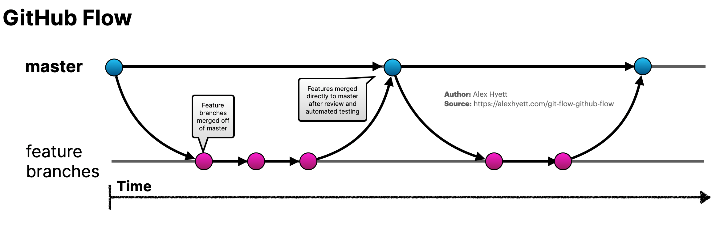
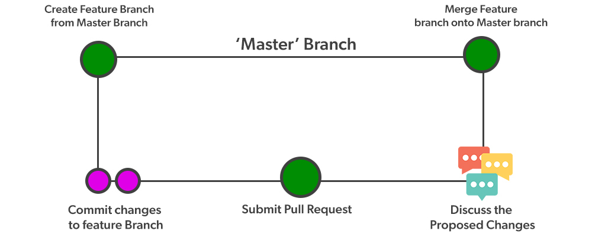
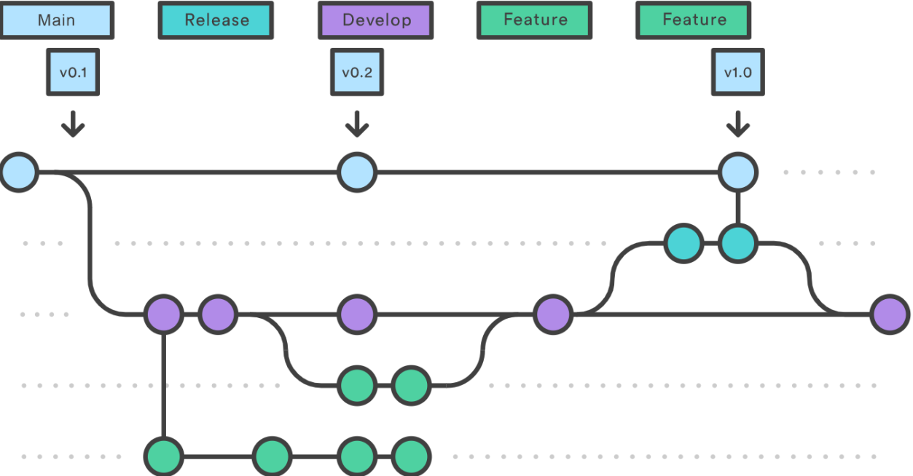

# Padrões para versionamento de projetos

## Branches

### Padrões nos nomes de branches

Nomes de branches são compostos de 2 partes:

- **Prefixos ou categoria do branch:**
  - **docs/**: apenas mudanças de documentação;
  - **feature/**: nova feature que será adicionada ao projeto, componente e afins;
  - **fix/**: correção de um bug;
  - **perf/**: mudança de código focada em melhorar performance;
  - **refactor/**: mudança de código que não adiciona uma funcionalidade e também não corrige um bug;
  - **style/**: mudanças no código que não afetam seu significado (espaço em branco, formatação, ponto e vírgula, etc);
  - **test/**: adicionar ou corrigir testes;
  - **improvement/**: uma melhoria em algo já existente, seja de performance, de escrita, de layout, etc.
- O que o branch faz em si.

Exemplos de alguns nomes de branches que podem existir:

- docs/padronizacao-commits-branches-git
- feat/cadastro-veiculos
- refactor/edicao-colaboradores
- fix/busca-checklists

## Commits

### Por que eu devo escrever boas mensagens de commit?

- Uma mensagem de commit para o Git bem redigida é a melhor maneira de comunicar o **contexto** de uma alteração para outros desenvolvedores que estejam trabalhando no projeto. De fato, até para o seu "eu" do futuro.

- As mensagens de commit podem comunicar adequadamente o **motivo** de uma alteração ter sido feita. Entender isso torna o desenvolvimento e a **colaboração** mais eficazes.

Em resumo, investir tempo em escrever boas mensagens de commit resulta em um código mais gerenciável, colaboração mais eficaz e um desenvolvimento mais ágil e sustentável.

### Como escrever boas mensagens de commit

Algumas regras gerais e dicas para escrever mensagens de commit – você tem de decidir qual convenção deseja seguir.

- [Conventional Commits](https://www.conventionalcommits.org/en/v1.0.0/) A especificação Conventional Commits é uma convenção leve sobre as mensagens de commit.
- [Angular Commit Message Guidelines](https://github.com/angular/angular.js/blob/master/DEVELOPERS.md#-git-commit-guidelines) Diretrizes de mensagem de confirmação Angular.
- [Udacity Git Commit](https://udacity.github.io/git-styleguide/) Udacity Git Commit Guia de estilo de mensagem
- [Styleguides](https://gist.github.com/crissilvaeng/dfb5b14f8eb2c25df4fd8a49f4f03252) Mensagens de commit styleguide.

Para criar um histórico de revisão útil, a equipe primeiro devem concordar quanto a uma convenção a ser utilizada nas mensagens de commit.

### Padrões nos nomes dos Commits

```javascript
<type>(<scope>): <subject>
<BLANK LINE>
<body>
<BLANK LINE>
<footer>
```

**Explicando:**

1. **type ou prefixos do commit**: podem ser os mesmos utilizados para criar branches.

2. **scope**: onde a alteração foi feita. Aqui, criamos nossos próprios scopes que, na maioria dos casos, refletem o nome de uma funcionalidade.

3. **subject**: um resumo do commit. Deve utilizar o imperativo, como: faz, adiciona, altera, muda, etc.

4. **body**: espaço utilizado para detalhar o que foi feito. É opcional.

5. **footer**: onde colocamos as PLs (códigos das tarefas no Jira) e também alguma breaking change.

_Observação_: Onde tem `<BLANK LINE>` significa que temos que deixar uma linha em branco.

### Prefixos dos Commits

- **docs**: apenas mudanças de documentação;
- **feat**: O nome já diz também o que é, uma nova feature que será adicionada ao projeto, componente e afins;
- **fix**: a correção de um bug;
- **perf**: mudança de código focada em melhorar performance;
- **refactor**: mudança de código que não adiciona uma funcionalidade e também não corrige um bug;
- **style**: mudanças no código que não afetam seu significado (espaço em branco, formatação, ponto e vírgula, etc);
- **test**: adicionar ou corrigir testes;
- **improvement**: Uma melhoria em algo já existente, seja de performance, de escrita, de layout, etc.

## Exemplo na prática

Aqui vou exemplificar uma sequência de alguns commits, comparando e mostrando a diferença entre apenas commitar e commitar usando commits semânticos:

<p align="center"><sub>Exemplo de commit semantico</sub></p>

<p align="center">
    
</p>

<p align="center">
    
</p>

A parte mais importante de uma mensagem de commit é o fato de que ela deve ser clara e significativa.

## Fluxo de trabalho

Uma dúvida muito comum a quem começa a usar o Git de maneira mais ativa é como organizar as branches, afinal, são muitos os problemas que um projeto pode enfrentar: De bugs urgentes que devem ser corrigidos, a criação de inúmeras features em conjunto com releases agrupando os deploys relativos a essas features.

### GitHub Flow

- [GitHub Flow](https://docs.github.com/pt/get-started/using-github/github-flow) O fluxo de GitHub é um fluxo de trabalho leve e baseado no branch.

Limitações:

- Ideal para quando já existe um produto, quando o produto ainda está em desenvolvimento acaba atrasando mais ainda o desenvolvimento devido a quantidade de branchs a serem gerenciadas.

- Não Ideal para Entregas Urgentes: Como envolve etapas de revisão e integração, o GitHub Flow pode não ser a melhor escolha para situações que exigem entregas muito rápidas ou em cenários onde a revisão formal do código é menos crítica.

Condições ideais:

- Recomendado para projetos onde a colaboração e a qualidade do código são prioridades, e onde há tempo para revisões e testes adequados antes da integração final.

<p align="center">
    
</p>

<p align="center">
    
</p>

O Gitflow é um modelo alternativo de ramificação do Git que consiste no uso de ramificações de recursos e várias ramificações primárias.

<p align="center">
    
</p>

### Trunk-based Development (Desenvolvimento Baseado em Tronco)

O desenvolvimento baseado em tronco segue um ritmo rápido para entregar código à produção. Manter commits e ramificações pequenas permite um ritmo mais rápido de merges e implementações.

Pequenas mudanças de um par de commits ou modificação de algumas linhas de código minimizam a sobrecarga cognitiva. É muito mais fácil para as equipes terem conversas significativas e tomar decisões rápidas ao revisar uma área limitada de código versus um conjunto extenso de alterações.

- Principais características do trunk based development (desenvolvimento baseado em tronco)
  - As ramificações devem ter ciclos de vida curto, ficando sempre perto da ramificação principal.
  - Ter três ou menos ramificações ativas no repositório de código do aplicativo
  - A ramificação principal sempre precisa estar em estado de pronto para deploy em produção.
  - Permite a integração e revisão contínua de código.
  - Realizar revisões de código assíncronas.
  - Permite versões consecutivas de código de produção.
  - Os hotfixes precisam ser criados a partir da ramificação principal e serem devolvidos à ramificação principal.
  - Recomendado para aplicações: Micros serviços, single page application, Prova de conceito (POC), Sistemas distribuídos.
  - É preciso ter um processo de integração contínua, com etapas de testes automatizados e validadores de qualidade de código.
  - Desenvolvimento baseado em troncos e CI/CD.

<p align="center">
    
</p>

## Ferramentas para gerenciamento GIT

- Padronização Commits

  - [Conventional Commits](https://marketplace.visualstudio.com/items?itemName=vivaxy.vscode-conventional-commits) Esta extensão do VS Code ajuda você a preencher a mensagem de commit de acordo com os [commits convencionais](https://www.conventionalcommits.org/en/v1.0.0/).
  - [Commitizen CLI](https://github.com/commitizen/cz-cli) ou [Commitlint CLI](https://github.com/conventional-changelog/commitlint) Ao fazer um commit com o Commitizen ou Commitlint, você será solicitado a preencher todos os campos de commit obrigatórios no momento do commit.

- Versionamento

  - [Versionamento Semântico 2.0.0](https://semver.org/lang/pt-BR/) Como uma solução para este problema proponho um conjunto simples de regras e requisitos que ditam como os números das versões são atribuídos e incrementados.

- Gitflow

  - [Git Flow](https://marketplace.visualstudio.com/items?itemName=Serhioromano.vscode-gitflow) Git FLow Support for VS Code.
  - [Git Flow](https://marketplace.visualstudio.com/items?itemName=vector-of-bool.gitflow) Gitflow integration for VS Code.

- [Lista de Clientes Git GUI](https://www.hostinger.com.br/tutoriais/git-gui) Os Melhores Clientes Git GUI para Windows, Linux e Mac.
  - [GitHub Desktop](https://github.com/apps/desktop) Uma ferramenta gráfica para ajudar e facilitar o uso de diversos comandos do git na sua máquina, evitando assim o uso dos comandos no terminal.
  - [Git History](https://marketplace.visualstudio.com/items?itemName=donjayamanne.githistory) Extensão do VS Code, Histórico do Git, pesquisa e mais (incluindo git log).
  - [Git Graph](https://marketplace.visualstudio.com/items?itemName=mhutchie.git-graph) Extensão do VS Code, Visualize um Git Graph do seu repositório e execute facilmente as ações do Git a partir do gráfico.
  - [SourceTree](https://www.sourcetreeapp.com/) Simplicidade e poder em uma bela GUI Git para Mac e Windows (Atlassian).
  - [Git Fork](https://git-fork.com/) Um cliente git rápido e amigável para Mac e Windows.
  - [GitKraken](https://www.gitkraken.com/) Inclui uma GUI Git intuitiva e uma poderosa CLI Git para Linux, Mac e Windows.
